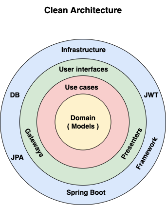

# Boilerplate Microservice

This boilerplate microservice is a microservice responsible for detecting and managing spam for HTTP requests in applications.

It provides **spam detection**, **threshold-based analysis**, **rule management**, and **multi-tenant support**.

> This service focuses on analyzing request patterns and user behavior to identify potential spam activities.


---

## How to generate a new micro service from this boilerplate ?

Follow the instructions from the following guide :

./doc/etapes_pour_vibecoder_un_micro_service.txt

The content is written in French, don't hesitate to translate if it is more convenient for you.

---

## ✅ Features

- 🛡️ **Dual spam detection strategy**
  - Repetitive request detection (URL + content analysis)
  - User IP-based detection
- ⚙️ **Configurable threshold system** with customizable periods and occurrence ranges
- 🔄 **Spam rule lifecycle management** (activation/deactivation, expiration)
- 🏢 **Multi-tenant support** via entityUuid
- 📊 **Complete REST API** with pagination and advanced filtering
- 🔍 **Flexible search capabilities** (EQUAL, LIKE, OR operators)

All business rules follow **Clean Architecture principles** to keep the core logic independent of frameworks and infrastructure concerns.



---

## 🛠️ Technologies Used

- **Java 17**
- **Spring Boot 3.4.1** (latest stable version)
- **Maven** as the build tool
- **PostgreSQL** for database
- **REST API** using Spring Web
- **Lombok** for reducing boilerplate code
- **Liquibase** for database migrations
- **OpenAPI Generator** for generating Presenters
- **Clean Architecture** software architecture

---

## 🏗️ Architecture

The project follows Clean Architecture principles with 4 Maven modules:

- **domain**: Business entities and repository interfaces (no external dependencies)
- **usecase**: Application logic (depends only on domain)
- **infrastructure**: Technical implementations (JPA, Spring Data, gateways)
- **ui**: REST API and contracts (OpenAPI, controllers)

---

## 🎯 How It Works

### Spam Detection Strategies

1. **Request-based detection**: Analyzes repetitive requests with the same URL and content
   - Default thresholds: 5, 10, 15, or 100 occurrences
   - Within periods: 1, 3, 5, or 60 minutes

2. **User IP-based detection**: Monitors requests from the same IP address
   - Default thresholds: 30, 100, or 1000 occurrences
   - Within periods: 1, 3, or 60 minutes

### Threshold Configuration

Each detection strategy uses configurable ranges:
- `sameRequestOccurenceRange` / `sameUserOccurenceRange`: Maximum allowed occurrences
- `sameRequestPeriodRange` / `sameUserPeriodRange`: Time periods in minutes

When a threshold is exceeded, the system automatically creates spam records for tracking and management.

---

## ▶️ How to Run

To launch the application:

```bash
# Complete build
./mvnw clean install

# Run the application
./mvnw -pl infrastructure spring-boot:run -Dspring-boot.run.profiles=h2
```

## How to debug 

```bash
# Complete build
./mvnw clean install

# Run the application in debug mode
./mvnw -pl infrastructure spring-boot:run -Dspring-boot.run.profiles=h2 -Dspring-boot.run.jvmArguments="-agentlib:jdwp=transport=dt_socket,server=y,suspend=y,address=5005"

# Add the breaking point in the app

# Click on left bar on "Run and Debug"

# Run the action "Attach Spring Boot (5005)"

```

---

## ▶️ How to Generate SQL Migration After Updating/Adding Entity

To generate migration files:

```bash
./mvnw -pl infrastructure liquibase:generateChangeLog \
  -Dliquibase.url=jdbc:h2:mem:testdb \
  -Dliquibase.outputFormat=yaml \
  -Dliquibase.outputChangeLogFile=src/main/resources/db/changelog/01-generated-schema.yaml
```

---

## ⚙️ Configuration

Required environment variables are defined in the `.env` file.

---

## 📡 API Endpoints

The service exposes three main resource endpoints:

- `/request-checks`: Manage spam verification requests
- `/request-spams`: Manage spam records for repetitive requests
- `/user-spams`: Manage spam records for user IPs

Each endpoint supports:
- Full CRUD operations
- Advanced filtering with operators (EQUAL, LIKE, OR)
- Pagination and sorting
- Count operations